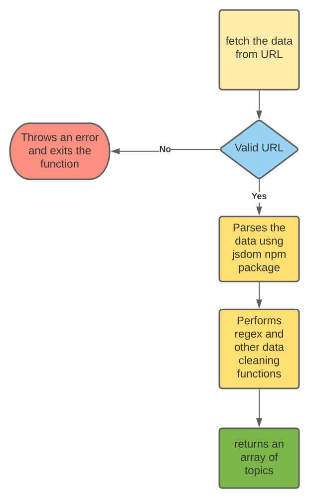

# Brightedge

## Project to predict the topic of the URL provided.

  

- I have developed this as part of the 48-Hour coding challenge. I used Javascript as my programming language.
- I used jsdom npm package for parsing the response of the fetch and isomorphic-fetch to fetch the data from the URL.

-I also used regular expressions to get rid of data which I don't need.

  

## Steps to run the project:

Run the below commands
- npm install
This command installs all the dependancy packages required for the project to run in the local environment.
- open the index.js file and replace the URL const with your url which you want to test.
- node index.js
This command will execute the function and returns an array of topics for that URL you mentioned.

